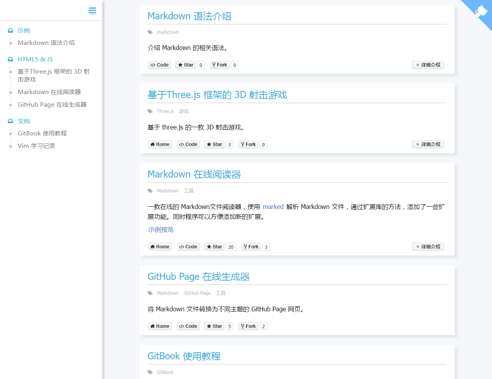

中文 | [English](README_EN.md)

# 项目列表模板

<!-- toc -->

- [前言](#%E5%89%8D%E8%A8%80)
- [使用](#%E4%BD%BF%E7%94%A8)
- [Markdown 文件规则](#markdown-%E6%96%87%E4%BB%B6%E8%A7%84%E5%88%99)
  * [项目开始标记](#项目开始标记)
  * [项目信息](#项目信息)
  * [项目介绍](#%E9%A1%B9%E7%9B%AE%E4%BB%8B%E7%BB%8D)
  * [完整示例](#完整示例)
- [全局配置](#%E5%85%A8%E5%B1%80%E9%85%8D%E7%BD%AE)

<!-- tocstop -->

## 前言
使用 Vue.js 写的一个项目列表模板，效果如下所示。使用时不需要修改模板文件，只要按一定规则编写 Markdown 文件即可。同时该项目逻辑比较简单，可以作为 Vue.js 的一个入门示例项目。

<kbd>

</kbd>

## 使用
1. clone 项目到本地
    ```
    git clone git@github.com:zhangjikai/project-list-template.git
    cd project-list-template
    ```
2. 按照规则编写 Markdown 文件
3. 使用 [在线工具](http://project.zhangjikai.com/generator/) 转换为 json 文件
4. 替换 data.json
5. 运行程序重新编译
    ```
    npm install
    gulp
    ```
    如果不想重新编译文件，可以使用 without-recompile 中的文件，该文件夹下的程序使用 `$.getJSON` 获取 json 文件，只需替换 json 文件，不需要重新编译。

## Markdown 文件规则
一个完整的项目介绍如下所示：
<pre lang="no-highlight"><code>&lt;!-- start -->

```config
{
    "name": "Markdown 语法介绍",
    "github": {
        "repo": "zhangjikai/project-list-template",
        "star":true,
        "fork":true
    },
    "code": "https://github.com/zhangjikai/project-list-template",
    "category": "Markdown",
    "tags" : ["markdown"]
}
```
介绍 Markdown 的相关语法。

&lt;!-- more -->

## Emphasis
Emphasis, aka italics, with *asterisks* or _underscores_.
Strong emphasis, aka bold, with **asterisks** or __underscores__.
Combined emphasis with **asterisks and _underscores_**.
Strikethrough uses two tildes. ~~Scratch this.~~

## Lists
* Unordered list can use asterisks
- Or minuses
+ Or pluses

</code></pre>

### 项目开始标记
 `<!-- start -->` 表示开始一个新的项目介绍，程序中通过该标识符将不同的项目介绍分开。

### 项目信息
程序中使用 lang 为 `config` 的代码块来设置项目的基本信息。代码块中是 JSON 格式的代码，下面是程序支持的所有的配置以及其默认值
<pre lang="no-highlight"><code>```config
{
    "name": "",
    "home": "",
    "code": "",
    "category": "---------------------------",
    "tags" : [],
    "github": {
        "repo": "",
        "star":true,
        "fork":true
    }

}
```
</code></pre>

* `name` - 项目名称
* `home` - 项目主页，为空则不显示相关按钮
* `code` - 项目代码地址，为空则不显示相关按钮
* `category` - 项目类别，根据该值进行分类显示，可以在 config.json 修改默认类别的值
* `tags` - 项目标签，数组类型
* `github` - 显示 github 的相关信息
  * `repo` - github 地址，格式为 `用户名/仓库`，如 `zhangjikai/project-list-template`
  * `star` - 是否显示 star 信息，默认为 true，如果 `repo` 为空，则将该值置为 false
  * `fork` - 是否显示 fork 信息，默认为 true，如果 `repo` 为空，则将该值置为 false

### 项目介绍
在项目介绍中使用正常的 Markdown 语法即可，如果项目介绍过长，可以使用 `<!-- more -->` 分割内容， `<!-- more -->` 之后的内容会被折叠起来，
```
项目简介
<!-- more -->
项目详细介绍
```

### 完整示例
[这里](demo/demo.md) 是一个完整的 Markdown 文件示例。

## 全局配置
可以在 config.json 里进行全局配置，下面是支持的配置项：

* `category` - 是否按类别显示项目，默认为 true
* `homeText` - 主页按钮显示的文字
* `codeText` - 代码地址按钮显示的文字
* `expandText` - 详细介绍按钮显示的文字
* `collapseText` - 收起介绍按钮显示的文字
* `defaultCategory` - 项目默认类别
* `github` - github corner，格式为 `用户名` 或者 `用户名/仓库`，为空则不显示
